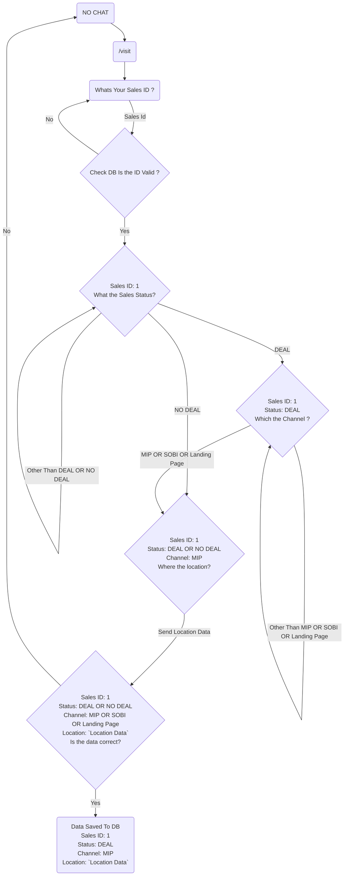

# Visit Dialog Flow

rough concept: user req -> reply back with response and other question -> repeat

## Example Successful Conversation

- a: /visit
- b: Whats Your Sales ID ?
- a: 1
- b: Sales ID: 1\nWhat the Sales Status?
- a: DEAL
- b: Sales ID: 1\nStatus: DEAL\nWhich the Channel?
- a: MIP
- b: Sales ID: 1\nStatus: DEAL\nChannel: MIP\nWhere the location?
- a: [SEND LOCATION]
- b: Sales ID: 1\nStatus: DEAL\nChannel: - MIP\nLocation: [Location Data]\nIs the data correct?
- a: Yes
- b: Data Saved To DB\nSales ID: 1\nStatus: DEAL\nChannel: MIP\nLocation: [Location Data]

## Flow Chart

